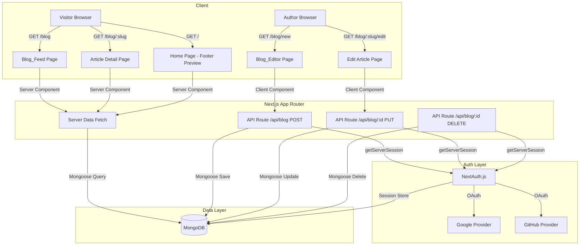

# Design Document: Blog System

## Overview

Blog System adalah modul penulisan dan publikasi artikel yang terintegrasi ke dalam website portofolio pribadi berbasis Next.js (App Router). Fitur ini memungkinkan pemilik website (Author) untuk membuat, mengedit, dan menghapus artikel setelah autentikasi via Google atau GitHub. Pengunjung (Visitor) dapat membaca artikel yang dipublikasikan tanpa perlu login. Preview artikel terbaru ditampilkan di dalam komponen `Footer.js` sebagai daya tarik visual.

### Tujuan Utama

- Menyediakan platform penulisan blog yang terintegrasi dengan website portofolio yang sudah ada
- Menggunakan infrastruktur yang sudah ada: Next.js App Router, MongoDB, NextAuth.js
- Memisahkan akses baca (publik) dan akses tulis (terautentikasi)
- Menampilkan preview artikel terbaru di footer untuk meningkatkan engagement pengunjung

### Keputusan Desain Utama

1. **App Router Next.js** — Menggunakan Server Components untuk data fetching di halaman publik (Blog_Feed, detail artikel, footer preview) demi performa SEO yang optimal.
2. **API Routes** — Operasi CRUD artikel dilakukan melalui API routes (`/api/blog`) yang diproteksi dengan `getServerSession` dari NextAuth.js.
3. **MongoDB dengan Mongoose** — Menggunakan Mongoose untuk schema validation dan query yang konsisten.
4. **Slug generation di server** — Slug dibuat di sisi server untuk menghindari race condition dan memastikan keunikan.

---

## Architecture



### Alur Data Utama

**Alur Baca (Visitor):**
```
Browser → Next.js Server Component → Mongoose Query → MongoDB → HTML Response
```

**Alur Tulis (Author):**
```
Browser (Client Component) → API Route → getServerSession → Mongoose → MongoDB
```

**Alur Autentikasi:**
```
Browser → NextAuth.js Route → OAuth Provider → Callback → Session Store (MongoDB)
```

---

## Components and Interfaces

### Struktur Direktori

```
app/
├── blog/
│   ├── page.js                    # Blog_Feed - daftar artikel publik
│   ├── new/
│   │   └── page.js                # Blog_Editor - buat artikel baru (protected)
│   └── [slug]/
│       ├── page.js                # Article Detail - baca artikel
│       └── edit/
│           └── page.js            # Blog_Editor - edit artikel (protected)
├── api/
│   ├── auth/
│   │   └── [...nextauth]/
│   │       └── route.js           # NextAuth.js handler
│   └── blog/
│       ├── route.js               # GET (list), POST (create)
│       └── [id]/
│           └── route.js           # PUT (update), DELETE (delete)
└── (auth)/
    └── login/
        └── page.js                # Halaman login

components/
├── blog/
│   ├── ArticleCard.js             # Kartu artikel untuk Blog_Feed
│   ├── ArticlePreview.js          # Preview artikel untuk Footer
│   ├── BlogEditor.js              # Form editor artikel (Client Component)
│   ├── BlogFeed.js                # Daftar artikel dengan pagination
│   └── DeleteConfirmDialog.js     # Dialog konfirmasi hapus artikel
├── Footer.js                      # Dimodifikasi: tambah ArticlePreview section
└── Navbar.jsx                     # Dimodifikasi: tambah link Blog & auth state

lib/
├── utils.js                       # Sudah ada: cn() utility
├── mongodb.js                     # Koneksi MongoDB (singleton)
├── models/
│   ├── Article.js                 # Mongoose model Article
│   └── User.js                    # Mongoose model User
└── blog/
    ├── slugify.js                 # Fungsi generate & validasi slug
    └── actions.js                 # Server Actions untuk data fetching
```

### Komponen Utama

#### `BlogEditor.js` (Client Component)
```javascript
// Props interface
{
  article?: {          // undefined = mode buat baru
    _id: string,
    title: string,
    content: string,
    excerpt: string,
    thumbnail: string,
    status: 'draft' | 'published'
  }
}
```

#### `ArticleCard.js`
```javascript
// Props interface
{
  article: {
    title: string,
    slug: string,
    excerpt: string,
    thumbnail?: string,
    authorName: string,
    publishedAt: Date
  }
}
```

#### `ArticlePreview.js` (untuk Footer)
```javascript
// Props interface
{
  articles: Array<{
    title: string,
    slug: string,
    excerpt: string,       // maks 100 karakter
    thumbnail?: string,
    publishedAt: Date
  }>
}
```

### API Routes Interface

#### `GET /api/blog`
```
Query params: page (default: 1), limit (default: 10), status (default: 'published')
Response: { articles: Article[], total: number, page: number, totalPages: number }
```

#### `POST /api/blog`
```
Body: { title, content, excerpt?, thumbnail?, status }
Auth: Required (getServerSession)
Response: { article: Article } | { error: string }
```

#### `PUT /api/blog/[id]`
```
Body: { title?, content?, excerpt?, thumbnail?, status? }
Auth: Required + ownership check
Response: { article: Article } | { error: string }
```

#### `DELETE /api/blog/[id]`
```
Auth: Required + ownership check
Response: { success: true } | { error: string }
```

### NextAuth.js Configuration

```javascript
// app/api/auth/[...nextauth]/route.js
{
  providers: [GoogleProvider, GitHubProvider],
  adapter: MongoDBAdapter,   // menyimpan sesi ke MongoDB
  callbacks: {
    session: ({ session, user }) => ({
      ...session,
      user: { ...session.user, id: user.id }
    })
  }
}
```

---

## Data Models

### Article Schema (MongoDB Collection: `articles`)

```javascript
// lib/models/Article.js
const ArticleSchema = new mongoose.Schema({
  title: {
    type: String,
    required: true,
    trim: true,
    maxlength: 200
  },
  slug: {
    type: String,
    required: true,
    unique: true,
    lowercase: true,
    trim: true
  },
  content: {
    type: String,
    required: true
  },
  excerpt: {
    type: String,
    maxlength: 160,
    default: ''
  },
  thumbnail: {
    type: String,   // URL gambar
    default: null
  },
  authorId: {
    type: mongoose.Schema.Types.ObjectId,
    ref: 'User',
    required: true
  },
  authorName: {
    type: String,
    required: true
  },
  status: {
    type: String,
    enum: ['draft', 'published'],
    default: 'draft'
  },
  publishedAt: {
    type: Date,
    default: null
  }
}, {
  timestamps: true   // otomatis menambah createdAt dan updatedAt
});

// Indexes
ArticleSchema.index({ slug: 1 }, { unique: true });
ArticleSchema.index({ status: 1, publishedAt: -1 });
ArticleSchema.index({ authorId: 1 });
```

### User Schema (MongoDB Collection: `users`)

```javascript
// lib/models/User.js
const UserSchema = new mongoose.Schema({
  name: {
    type: String,
    required: true
  },
  email: {
    type: String,
    required: true,
    unique: true,
    lowercase: true
  },
  image: {
    type: String,
    default: null
  },
  provider: {
    type: String,
    enum: ['google', 'github'],
    required: true
  }
}, {
  timestamps: true
});

UserSchema.index({ email: 1 }, { unique: true });
```

### Slug Generation Logic

```javascript
// lib/blog/slugify.js

/**
 * Menghasilkan slug dari judul artikel.
 * Contoh: "Cara Belajar Next.js!" → "cara-belajar-nextjs"
 */
export function generateSlug(title) {
  return title
    .toLowerCase()
    .trim()
    .replace(/[^a-z0-9\s-]/g, '')   // hapus karakter non-alfanumerik (kecuali spasi & -)
    .replace(/\s+/g, '-')            // ganti spasi dengan -
    .replace(/-+/g, '-');            // hapus duplikat -
}

/**
 * Memastikan slug unik di database.
 * Jika slug sudah ada, tambahkan sufiks numerik: slug-2, slug-3, dst.
 */
export async function ensureUniqueSlug(baseSlug, excludeId = null) {
  let slug = baseSlug;
  let counter = 2;
  while (true) {
    const query = { slug };
    if (excludeId) query._id = { $ne: excludeId };
    const existing = await Article.findOne(query);
    if (!existing) return slug;
    slug = `${baseSlug}-${counter++}`;
  }
}
```

### Excerpt Auto-generation

Jika Author tidak mengisi excerpt, sistem akan mengambil 160 karakter pertama dari `content` (setelah strip HTML/markdown) sebagai excerpt default.

---

## Correctness Properties

*A property is a characteristic or behavior that should hold true across all valid executions of a system — essentially, a formal statement about what the system should do. Properties serve as the bridge between human-readable specifications and machine-verifiable correctness guarantees.*

### Property 1: Slug generation adalah fungsi deterministik

*For any* judul artikel yang valid (non-kosong), fungsi `generateSlug` harus selalu menghasilkan slug yang: (a) hanya mengandung karakter lowercase alfanumerik dan tanda hubung, (b) tidak diawali atau diakhiri tanda hubung, dan (c) tidak mengandung tanda hubung berurutan.

**Validates: Requirements 3.3**

### Property 2: Slug uniqueness setelah insert

*For any* kumpulan artikel yang tersimpan di database, tidak boleh ada dua artikel yang memiliki nilai `slug` yang sama. Jika slug yang dihasilkan sudah ada, sistem harus menambahkan sufiks numerik sehingga slug baru tetap unik.

**Validates: Requirements 3.3, 3.4**

### Property 3: Artikel draft tidak terlihat oleh Visitor

*For any* query ke Blog_Feed atau detail artikel oleh Visitor (tanpa sesi autentikasi), semua artikel yang dikembalikan harus memiliki `status === "published"`. Tidak ada artikel dengan `status === "draft"` yang boleh muncul dalam respons.

**Validates: Requirements 5.1, 5.4**

### Property 4: Ownership check pada operasi write

*For any* permintaan PUT atau DELETE ke `/api/blog/[id]`, jika `session.user.id` tidak sama dengan `article.authorId`, maka sistem harus mengembalikan HTTP 403 dan tidak melakukan perubahan pada database.

**Validates: Requirements 4.3, 4.5**

### Property 5: Excerpt selalu dalam batas karakter

*For any* artikel yang tersimpan di MongoDB, nilai field `excerpt` tidak boleh melebihi 160 karakter. Jika excerpt yang diberikan melebihi batas, sistem harus memotongnya.

**Validates: Requirements 5.5, 7.1**

### Property 6: Article Preview di Footer hanya menampilkan artikel published

*For any* pemanggilan data untuk komponen `ArticlePreview` di Footer, semua artikel yang dikembalikan harus memiliki `status === "published"` dan jumlahnya tidak melebihi 3.

**Validates: Requirements 6.1, 6.2**

### Property 7: Validasi field wajib artikel

*For any* permintaan POST ke `/api/blog` dengan `title` atau `content` yang kosong (string kosong atau hanya whitespace), sistem harus menolak permintaan tersebut dan tidak menyimpan data ke database.

**Validates: Requirements 3.7**

---

## Error Handling

### Strategi Error Handling

| Skenario | HTTP Status | Respons |
|---|---|---|
| Visitor akses halaman protected | 302 Redirect | Redirect ke `/login` |
| Sesi kedaluwarsa saat edit | 401 Unauthorized | Simpan draft ke localStorage, redirect login |
| Artikel tidak ditemukan | 404 Not Found | Halaman 404 custom |
| Artikel draft diakses Visitor | 404 Not Found | Halaman 404 (tidak mengungkap status draft) |
| Edit/hapus artikel milik orang lain | 403 Forbidden | `{ error: "Anda tidak memiliki izin..." }` |
| Koneksi MongoDB gagal | 503 Service Unavailable | `{ error: "Service tidak tersedia" }` + log server |
| Validasi field gagal (client) | - | Pesan inline di form, tidak kirim ke server |
| Validasi field gagal (server) | 400 Bad Request | `{ error: "...", fields: [...] }` |
| OAuth error / dibatalkan | - | Redirect ke `/login?error=...` dengan pesan deskriptif |
| Slug duplikat | - | Auto-resolve dengan sufiks numerik (bukan error) |

### Middleware Proteksi Route

```javascript
// middleware.js (Next.js Middleware)
export { default } from 'next-auth/middleware';

export const config = {
  matcher: ['/blog/new', '/blog/:slug/edit']
};
```

### Error Boundary

Halaman blog menggunakan `error.js` di level route untuk menangkap error rendering yang tidak terduga dan menampilkan UI fallback yang ramah pengguna.

### Koneksi MongoDB (Singleton Pattern)

```javascript
// lib/mongodb.js
let cached = global.mongoose;
if (!cached) {
  cached = global.mongoose = { conn: null, promise: null };
}

export async function connectDB() {
  if (cached.conn) return cached.conn;
  if (!cached.promise) {
    cached.promise = mongoose.connect(process.env.MONGODB_URI);
  }
  try {
    cached.conn = await cached.promise;
  } catch (e) {
    cached.promise = null;
    throw e;  // akan ditangkap oleh API route → HTTP 503
  }
  return cached.conn;
}
```

---

## Testing Strategy

### Pendekatan Pengujian

Sistem blog menggunakan dua lapisan pengujian yang saling melengkapi:

1. **Unit Tests** — Menguji fungsi-fungsi murni (pure functions) dengan contoh spesifik dan edge case
2. **Property-Based Tests** — Menguji properti universal yang harus berlaku untuk semua input valid

### Library yang Digunakan

- **Test runner**: [Jest](https://jestjs.io/) (standar ekosistem Next.js)
- **Property-based testing**: [fast-check](https://fast-check.io/) — library PBT untuk JavaScript/TypeScript
- **Mocking**: `jest.mock()` untuk Mongoose dan NextAuth.js

### Unit Tests

#### `lib/blog/slugify.js`
- `generateSlug("Hello World")` → `"hello-world"`
- `generateSlug("Cara Belajar Next.js!")` → `"cara-belajar-nextjs"`
- `generateSlug("  spasi  di  awal  akhir  ")` → `"spasi-di-awal-akhir"`
- `generateSlug("")` → `""` (string kosong)
- `ensureUniqueSlug` menambahkan `-2`, `-3` dst. jika slug sudah ada

#### API Routes (`/api/blog`)
- POST dengan body valid → 201 Created + artikel tersimpan
- POST tanpa `title` → 400 Bad Request
- POST tanpa `content` → 400 Bad Request
- POST tanpa sesi → 401 Unauthorized
- PUT dengan `authorId` berbeda → 403 Forbidden
- DELETE dengan `authorId` berbeda → 403 Forbidden
- GET artikel draft oleh Visitor → tidak muncul di hasil

#### Komponen
- `ArticlePreview` merender judul, excerpt, dan tanggal dengan benar
- `BlogEditor` menampilkan pesan validasi saat field kosong
- `BlogFeed` merender pagination dengan benar

### Property-Based Tests (fast-check)

Setiap property test dikonfigurasi dengan minimum **100 iterasi**.

```javascript
// Contoh implementasi property test
import fc from 'fast-check';
import { generateSlug } from '@/lib/blog/slugify';

// Feature: blog-system, Property 1: Slug generation adalah fungsi deterministik
test('slug hanya mengandung karakter valid', () => {
  fc.assert(
    fc.property(
      fc.string({ minLength: 1 }),
      (title) => {
        const slug = generateSlug(title);
        // Slug hanya boleh mengandung a-z, 0-9, dan -
        expect(slug).toMatch(/^[a-z0-9-]*$/);
        // Tidak diawali atau diakhiri -
        expect(slug).not.toMatch(/^-|-$/);
        // Tidak ada -- berurutan
        expect(slug).not.toMatch(/--/);
      }
    ),
    { numRuns: 100 }
  );
});
```

#### Daftar Property Tests

| Property | Tag | Deskripsi |
|---|---|---|
| Property 1 | `Feature: blog-system, Property 1` | Slug generation deterministik |
| Property 2 | `Feature: blog-system, Property 2` | Slug uniqueness setelah insert |
| Property 3 | `Feature: blog-system, Property 3` | Draft tidak terlihat Visitor |
| Property 4 | `Feature: blog-system, Property 4` | Ownership check pada write |
| Property 5 | `Feature: blog-system, Property 5` | Excerpt dalam batas karakter |
| Property 6 | `Feature: blog-system, Property 6` | Footer preview hanya published |
| Property 7 | `Feature: blog-system, Property 7` | Validasi field wajib artikel |

### Integration Tests

- Koneksi MongoDB berhasil dengan `MONGODB_URI` yang valid
- NextAuth.js callback menyimpan data user ke collection `users`
- Index unik pada `slug` mencegah duplikasi di level database

### Cakupan Test yang Diharapkan

- Fungsi `slugify`: 100% (pure function, mudah ditest)
- API routes: 80%+ (dengan mock Mongoose dan NextAuth)
- Komponen UI: 70%+ (unit test dengan React Testing Library)
